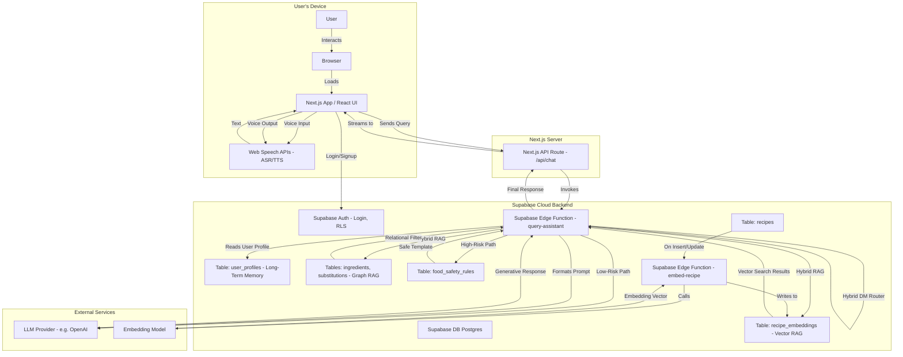

# AI Cooking Assistant - System Architecture

## Executive Summary

This document presents the system architecture for an AI-powered cooking assistant platform. The solution leverages Next.js for client-facing interfaces and Supabase as a unified backend infrastructure encompassing authentication, database management, vector storage, and serverless compute capabilities.

The architectural design incorporates established research methodologies including Hybrid Conversational User Interface (CUI) systems, Hybrid Retrieval-Augmented Generation (RAG), multimodal interaction patterns, and privacy-preserving security controls.

**Document Version:** 1.0  
**Last Updated:** November 3, 2025  
**Target Audience:** Engineering Teams, System Architects, Technical Stakeholders

---

## Table of Contents

1. [System Architecture Overview](#1-system-architecture-overview)
2. [Component Architecture](#2-component-architecture)
3. [Technology Stack](#3-technology-stack)
4. [Implementation Specifications](#4-implementation-specifications)

---

## 1. System Architecture Overview

### 1.1 Architecture Diagram

The following diagram illustrates the system's data flow, component interactions, and integration boundaries across client, application, and backend layers.



### 1.2 Architectural Principles

The system architecture adheres to the following core principles:

- **Separation of Concerns:** Clear boundaries between presentation, application, and data layers
- **Security by Design:** Row-level security policies and authentication integrated at the infrastructure level
- **Scalability:** Serverless compute and managed database services for elastic scaling
- **Modularity:** Loosely coupled components enabling independent deployment and testing
- **Observability:** Structured logging and monitoring capabilities across all layers

---

## 2. Component Architecture

### 2.1 Client Layer (Next.js)

The client layer provides user-facing interfaces and manages client-side application state.

#### 2.1.1 User Interface Components

**Chat Interface** (`app/page.tsx`)
- Manages conversational message flow and state transitions
- Implements CUI state machine with discrete states: `listening`, `processing`, `speaking`
- Provides real-time user feedback and interaction affordances

**Multimodal Input/Output** (`hooks/useSpeech.ts`)
- Encapsulates browser-native Web Speech API integration
- Implements Automatic Speech Recognition (ASR) for voice input
- Provides Text-to-Speech (TTS) synthesis for audio output
- Addresses accessibility requirements for hands-free operation

**Redundant Display Pattern**
- All spoken content rendered simultaneously as visual text
- Ensures information accessibility across modalities
- Implements CARE framework redundancy principles

#### 2.1.2 API Gateway Layer

**Backend for Frontend (BFF)** (`app/api/chat/route.ts`)
- Serves as security boundary between client and backend services
- Validates and sanitizes incoming user requests
- Manages session authentication and authorization
- Orchestrates calls to Supabase Edge Functions
- Implements request/response transformation logic

---

### 2.2 Backend Layer (Supabase)

The backend layer implements core business logic, data persistence, and RAG pipeline orchestration.

#### 2.2.1 Authentication & Authorization

**Supabase Authentication Service**
- Multi-provider authentication support (email/password, OAuth providers)
- JWT-based session management
- Role-based access control (RBAC) capabilities

**Row-Level Security (RLS)**
- Declarative security policies enforced at the database layer
- User-scoped data isolation for personally identifiable information (PII)
- Prevents unauthorized access to user profiles, preferences, and allergen data
- Implements privacy-by-design architectural pattern

**Security Policy Example:**
```sql
CREATE POLICY user_profile_isolation ON user_profiles
  USING (auth.uid() = user_id);
```

#### 2.2.2 Conversational Pipeline & Dialogue Management

**Query Assistant Edge Function** (`query-assistant`)

The query assistant implements a hybrid dialogue management strategy combining rule-based and generative approaches.

**Natural Language Understanding (NLU)**
- Intent classification using lightweight ML models or pattern matching
- Entity extraction for parameters (ingredients, dietary restrictions, etc.)
- Confidence scoring for routing decisions

**Dialogue Manager Router**

The routing logic implements a decision tree based on intent classification:

```
IF intent IN [check_food_safety, query_allergen, verify_edibility]
  ROUTE TO: Rule-Based Safety Path
ELSE IF intent IN [find_recipe, suggest_substitution, cooking_advice]
  ROUTE TO: LLM-RAG Generative Path
ELSE
  ROUTE TO: Fallback Handler
```

**Rule-Based Safety Path**
- Deterministic response generation from curated knowledge base
- Zero-tolerance policy for LLM hallucination risk on safety-critical queries
- Queries `food_safety_rules` table for verified FDA/USDA guidelines
- Returns templated responses with source attribution
- Architectural guarantee: No generative model invocation for high-risk queries

**LLM-RAG Generative Path**
- Handles creative, open-ended conversational queries
- Implements Retrieval-Augmented Generation (RAG) pipeline
- Grounds responses in verified recipe and ingredient databases
- Applies user context personalization (dietary preferences, allergies)

#### 2.2.3 Hybrid RAG Implementation

The system implements a multi-strategy retrieval architecture combining vector similarity search and relational graph querying.

**Vector RAG Component**

*Indexing Pipeline:*
1. Recipe insertion triggers `embed-recipe` Edge Function
2. Document chunking with configurable overlap strategy
3. Embedding generation via external embedding service
4. Vector storage in `recipe_embeddings` table using `pgvector` extension

*Retrieval Pipeline:*
1. User query embedding generation
2. Cosine similarity search against `recipe_embeddings`
3. Top-K candidate retrieval (configurable, default K=10)

**Graph RAG Component**

The relational database schema models a semantic knowledge graph:

*Schema Design:*
```sql
-- Ingredient entity table
CREATE TABLE ingredients (
  id UUID PRIMARY KEY,
  name TEXT NOT NULL,
  allergen_group TEXT,
  nutritional_data JSONB
);

-- Substitution relationship table
CREATE TABLE substitutions (
  id UUID PRIMARY KEY,
  original_ingredient_id UUID REFERENCES ingredients(id),
  substitute_ingredient_id UUID REFERENCES ingredients(id),
  substitution_ratio DECIMAL,
  context TEXT
);
```

*Query Pattern:*
```sql
-- Example: Find egg substitutes excluding tree nuts
SELECT s.substitute_ingredient_id, i.name
FROM substitutions s
JOIN ingredients i ON s.substitute_ingredient_id = i.id
WHERE s.original_ingredient_id = (SELECT id FROM ingredients WHERE name = 'egg')
  AND i.allergen_group != 'tree_nut';
```

**Hybrid Retrieval Workflow**

1. **Context Retrieval:** Fetch user profile data (`allergies`, `dietary_preferences`) from `user_profiles`
2. **Vector Search:** Execute semantic similarity search returning candidate recipes
3. **Relational Filtering:** Apply allergen exclusion and dietary constraint filters using SQL
4. **Context Augmentation:** Construct LLM prompt with retrieved, filtered recipe data
5. **Response Generation:** Invoke LLM with augmented context for fluent response synthesis
6. **Safety Validation:** Post-generation validation against content policy rules

---

## 3. Technology Stack

### 3.1 Frontend Technologies

| Component | Technology | Version | Purpose |
|-----------|-----------|---------|---------|
| Framework | Next.js | 14.x | React-based application framework with SSR/SSG capabilities |
| UI Library | React | 18.x | Component-based user interface library |
| Language | TypeScript | 5.x | Type-safe JavaScript superset |
| Styling | Tailwind CSS | 4.x | Utility-first CSS framework |
| Component Library | shadcn/ui | Latest | Accessible, customizable UI components |

### 3.2 Backend Technologies

| Component | Technology | Purpose |
|-----------|-----------|---------|
| Backend Platform | Supabase | Unified backend services (Auth, DB, Storage, Functions) |
| Database | PostgreSQL | 15.x with `pgvector` extension |
| Serverless Compute | Supabase Edge Functions | Deno-based serverless runtime |
| Vector Search | pgvector | PostgreSQL extension for embedding storage and similarity search |

### 3.3 External Services

| Service | Purpose | Integration Pattern |
|---------|---------|---------------------|
| LLM Provider | Natural language generation | API-based, model-agnostic (OpenAI, Anthropic, etc.) |
| Embedding Model | Text vectorization for semantic search | API-based or self-hosted |

---

## 4. Implementation Specifications

### 4.1 Project Directory Structure

```
/ai-cooking-assistant
├── /app                            # Next.js App Router directory
│   ├── /api                        # API route handlers
│   │   └── /chat
│   │       └── route.ts            # Chat API endpoint (BFF pattern)
│   ├── layout.tsx                  # Root layout component
│   └── page.tsx                    # Main application entry point
├── /components                     # React components
│   ├── ChatInterface.tsx           # Primary chat UI component
│   ├── ChatMessage.tsx             # Message rendering component
│   └── MicrophoneButton.tsx        # Voice input control component
├── /hooks                          # Custom React hooks
│   └── useSpeech.ts                # Web Speech API integration hook
├── /lib                            # Shared utilities and configurations
│   └── supabaseClient.ts           # Supabase client initialization
├── /public                         # Static assets
│   └── ...
├── /supabase                       # Supabase configuration and functions
│   ├── /functions                  # Edge Functions
│   │   ├── /query-assistant        # Main dialogue management function
│   │   │   └── index.ts
│   │   ├── /embed-recipe           # Recipe embedding pipeline function
│   │   │   └── index.ts
│   │   └── /_shared                # Shared function utilities
│   │       └── cors.ts
│   └── /migrations                 # Database schema migrations
│       └── 20251103_init_schema.sql
├── package.json                    # Node.js dependencies and scripts
├── tsconfig.json                   # TypeScript configuration
└── next.config.js                  # Next.js configuration
```

### 4.2 Data Flow Patterns

**Synchronous Request Flow:**
1. User initiates query via UI
2. Client sends request to Next.js API route
3. API route authenticates session and forwards to Edge Function
4. Edge Function executes business logic and returns response
5. API route streams response to client
6. Client updates UI with response

**Asynchronous Indexing Flow:**
1. Recipe inserted/updated in `recipes` table
2. Database trigger invokes `embed-recipe` Edge Function
3. Function chunks recipe content and generates embeddings
4. Embeddings persisted to `recipe_embeddings` table
5. Vector index automatically updated for search availability

### 4.3 Security Considerations

- **Data Privacy:** User PII protected via RLS policies; profile data never leaves user's security boundary
- **Input Validation:** All user inputs sanitized at API gateway layer
- **Authentication:** Session-based authentication with secure token management
- **Authorization:** Fine-grained access control via database-level policies
- **Content Safety:** High-risk queries routed to rule-based deterministic responses
- **Audit Logging:** All data access events logged for compliance and security analysis

### 4.4 Scalability & Performance

- **Serverless Architecture:** Automatic scaling of Edge Functions based on demand
- **Database Optimization:** Indexed queries, connection pooling, and query optimization
- **Vector Search Performance:** `pgvector` with HNSW indexing for sub-linear search complexity
- **Caching Strategy:** Client-side query caching and CDN distribution for static assets
- **Streaming Responses:** Chunked transfer encoding for progressive UI updates

---

## Appendix

### A. Research References

This architecture implements patterns and methodologies from established research:

- **Sec 3.4:** Hybrid CUI Systems with Router-First Dialogue Management
- **Sec 4.4:** Hybrid RAG combining vector and graph-based retrieval
- **Sec 5.1:** Multimodal interaction patterns (voice/text)
- **Sec 6.4:** Privacy-preserving design patterns
- **Sec 6.5:** Safety-critical query handling strategies

### B. Glossary

- **ASR:** Automatic Speech Recognition
- **BFF:** Backend for Frontend
- **CUI:** Conversational User Interface
- **NLG:** Natural Language Generation
- **NLU:** Natural Language Understanding
- **RAG:** Retrieval-Augmented Generation
- **RLS:** Row-Level Security
- **TTS:** Text-to-Speech

---

**Document End**
