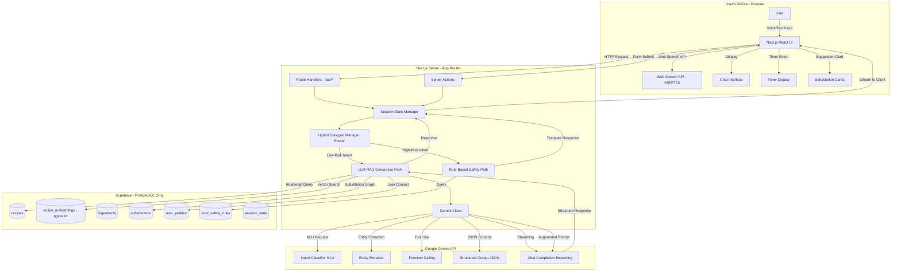

# AI Cooking Assistant - System Architecture

This document presents the system architecture for **I'm Cooked**, a conversational AI cooking assistant that supports text and voice input. The solution leverages **Next.js App Router** for all backend logic (server actions and route handlers), **Google Gemini** for natural language understanding and generation, and **Supabase** exclusively for database storage.

The architecture implements a **hybrid dialogue management** strategy combining rule-based deterministic responses for safety-critical queries and LLM-based generative responses for creative cooking guidance, grounded in established research from conversation design, RAG systems, and responsible AI principles.

**Document Version:** 2.0  
**Last Updated:** November 3, 2025  
**Target Audience:** Engineering Teams, System Architects, Technical Stakeholders

---

## Table of Contents

1. [System Architecture Overview](#1-system-architecture-overview)
2. [Core Design Principles](#2-core-design-principles)
3. [Component Architecture](#3-component-architecture)
4. [Technology Stack](#4-technology-stack)
5. [Conversation Design](#5-conversation-design)
6. [Retrieval-Augmented Generation (RAG)](#6-retrieval-augmented-generation-rag)
7. [Dialogue Management](#7-dialogue-management)
8. [Multimodal Interaction](#8-multimodal-interaction)
9. [Responsible AI](#9-responsible-ai)
10. [Implementation Plan](#10-implementation-plan)
11. [API Contracts](#11-api-contracts)
12. [Data Schemas](#12-data-schemas)

---

## 1. System Architecture Overview

### 1.1 Architecture Diagram



### 1.2 Architectural Principles

- **Conversation-First Design:** All interactions follow conversation design principles (intents, slots, repair strategies, confirmations)
- **Hybrid Dialogue Management:** Rule-based for safety-critical paths, LLM-based for creative guidance
- **Next.js Backend Ownership:** All business logic, state management, and AI orchestration runs in Next.js
- **Supabase as Storage Only:** PostgreSQL database for recipes, embeddings, user profiles—no server-side processing
- **Retrieval-Augmented Generation:** Gemini responses grounded in verified recipe data via hybrid RAG (vector + relational)
- **Responsible AI by Design:** Safety rules, bias mitigation, transparency, privacy controls integrated from day one
- **Multimodal Accessibility:** Voice-first with redundant visual display for hands-free cooking

---

## 2. Core Design Principles

### 2.1 Human-Centered Design (HCD) Foundations

The system is built on an iterative HCD loop:

1. **Understand Context:** Contextual inquiry in real kitchens to observe cooking workflows, "messy hands" problem, noise, multitasking
2. **Design & Prototype:** Wizard-of-Oz prototyping to test conversation flows before implementation
3. **Evaluate:** Quantitative (task completion, error rate) and qualitative (user interviews, thematic analysis) testing

**Key User Insight:** The kitchen environment demands hands-free operation due to wet/dirty hands, background noise (blenders, fans), and frequent interruptions. Voice-first interface is not optional—it's a core functional requirement.

### 2.2 Value-Sensitive Design (VSD)

Ethical considerations integrated throughout development:

- **Well-being:** Accurate cooking times, safe temperatures, allergy handling
- **Privacy:** User health data (allergies, dietary restrictions) protected via RLS policies
- **Autonomy:** User is the "chef," AI is the "sous-chef" assistant
- **Trust:** Transparent limitations, source attribution, no hallucinations on safety queries
- **Fairness:** Culturally diverse recipe database, no algorithmic bias in recommendations

### 2.3 Conversational User Interface (CUI) Theory

**CASA Paradigm:** Users unconsciously treat the AI as a social actor. Persona design must be intentional to guide expectations and prevent overtrust.

**Gricean Maxims:**
- **Quantity:** Be informative but concise (provide current step, not all future steps)
- **Quality:** Be truthful (never hallucinate—use RAG grounding)
- **Relevance:** Stay on topic (substitutions for salt, not salt trade history)
- **Manner:** Be clear and orderly (specific units, temperatures, times)

**Grounding:** Confirm critical information with explicit confirmations:
- User: "I'm allergic to nuts."
- Bot: "Got it. I'll exclude all recipes containing nuts. Is that correct?"

---

## 3. Component Architecture

### 3.1 Client Layer (Next.js + React)

**Responsibilities:**
- Render UI components (chat interface, recipe cards, timers, substitution suggestions)
- Capture user input via text or voice (Web Speech API)
- Stream responses from server via Server-Sent Events (SSE) or WebSocket
- Manage client-side state (current recipe step, active timers, chat history)
- Provide accessible, multimodal output (TTS + visual text redundancy)

**Key Components:**
- `ChatInterface.tsx`: Main conversational UI with message history
- `VoiceInputButton.tsx`: Microphone control with ASR integration
- `RecipeStepDisplay.tsx`: Step-by-step instructions with timer controls
- `SubstitutionCard.tsx`: Contextual ingredient swap suggestions
- `TimerManager.tsx`: Hands-free timer creation and alerts

**Web Speech API Integration:**
- **ASR (Speech Recognition):** Converts voice input to text, handles noise robustness testing
- **TTS (Speech Synthesis):** Reads responses aloud for hands-free operation
- **Wake Word Detection:** Optional "Hey Chef" activation for true hands-free mode

### 3.2 Server Layer (Next.js App Router)

All backend logic runs in Next.js. No server-side processing in Supabase.

**Route Handlers** (`/app/api/*`):
- `/api/chat` - Main conversational endpoint (streaming responses)
- `/api/recipes/search` - Semantic recipe search via Gemini + RAG
- `/api/recipes/[id]` - Recipe detail retrieval
- `/api/substitutions` - Ingredient substitution recommendations
- `/api/timers` - Timer management (create, update, delete)
- `/api/intent` - Intent detection for routing decisions

**Server Actions** (`use server`):
- `detectIntent(message: string)` - NLU intent classification
- `extractEntities(message: string)` - Entity extraction (ingredients, times, tools)
- `planCookingSteps(recipeId: string)` - Generate step-by-step plan with timings
- `findSubstitutions(ingredient: string, allergies: string[])` - Safe substitution lookup
- `checkFoodSafety(query: string)` - Rule-based safety validation

**Session State Manager:**
- Server-side session storage (Redis or Vercel KV for production, in-memory for dev)
- Tracks conversation state: current recipe, active step, filled slots, dialogue history
- Manages short-term memory (current session) and long-term memory (user profile)

**Hybrid Dialogue Manager Router:**
- Intent classification → route to appropriate path
- High-risk intents (`check_food_safety`, `query_allergen`, `verify_temperature`) → Rule-Based Path
- Low-risk intents (`find_recipe`, `suggest_substitution`, `next_step`) → LLM-RAG Path

---

## 4. Technology Stack

### 4.1 Frontend Technologies

| Component | Technology | Version | Purpose |
|-----------|-----------|---------|---------|
| Framework | Next.js | 16.x | React framework with App Router, Server Actions, SSR |
| UI Library | React | 19.x (RC) | Component-based UI with Server Components |
| Language | TypeScript | 5.x | Type-safe development |
| Styling | Tailwind CSS | 4.x | Utility-first CSS framework |
| Components | shadcn/ui | Latest | Accessible, customizable Radix UI components |
| Voice | Web Speech API | Native | ASR (SpeechRecognition) + TTS (SpeechSynthesis) |

### 4.2 Backend Technologies

| Component | Technology | Purpose |
|-----------|-----------|---------|
| Server Runtime | Next.js App Router | Server Actions, Route Handlers, Streaming |
| AI Provider | Google Gemini API | NLU, generation, function calling, structured outputs |
| Database | Supabase PostgreSQL | Recipe storage, user profiles, embeddings |
| Vector Search | pgvector | Semantic similarity search for recipes |
| Session Store | Vercel KV / Redis | Server-side session state management |
| Realtime | Server-Sent Events | Streaming responses from Gemini to client |

### 4.3 AI Model Selection

**Google Gemini 2.0 Flash**
- **Strengths:** Function calling, structured outputs (JSON mode), multimodal (text + future image support), streaming, grounding with Google Search
- **Use Cases:**
  - Intent detection and entity extraction (NLU)
  - Recipe search with semantic understanding
  - Conversational response generation (RAG-augmented)
  - Structured outputs for timers, substitutions (JSON schema enforcement)
  - Function calling for tool use (database queries, API calls)

**Model Configuration:**
- Temperature: 0.2 for NLU/safety, 0.7 for creative responses
- Top-p: 0.9
- Max tokens: 2048 for responses, 512 for NLU
- Safety settings: Block medium+ harmful content

---

## 5. Conversation Design

### 5.1 Core Intents

**Recipe Discovery:**
- `find_recipe`: Search for recipes by name, cuisine, ingredients, dietary preferences
- `filter_recipe`: Apply constraints (time, difficulty, available ingredients)

**Cooking Guidance:**
- `start_cooking_plan`: Begin step-by-step guided cooking
- `next_step`: Advance to next instruction
- `previous_step`: Go back to previous step
- `repeat_step`: Repeat current instruction
- `pause_cooking`: Pause session (handle interruptions)
- `resume_cooking`: Resume from pause

**Clarification & Learning:**
- `ask_clarification`: "What does 'julienne' mean?"
- `ask_technique`: "How do I fold egg whites?"
- `ask_timing`: "How long should I sauté this?"

**Substitutions:**
- `suggest_substitution`: "What can I use instead of buttermilk?"
- `verify_substitution`: "Can I use honey instead of sugar?"

**Safety:**
- `check_food_safety`: "Is this chicken cooked properly?"
- `query_allergen`: "Does this recipe contain nuts?"
- `verify_temperature`: "What temperature for medium-rare steak?"

**Timers:**
- `set_timer`: "Set a timer for 20 minutes"
- `check_timer`: "How much time left?"
- `cancel_timer`: "Stop the timer"

### 5.2 Entity Extraction

**Slot Filling:**
- `ingredient`: Flour, sugar, chicken breast, olive oil
- `cuisine`: Italian, Thai, Mexican, French
- `diet_restriction`: Vegan, vegetarian, gluten-free, keto, paleo
- `allergen`: Peanuts, tree nuts, dairy, shellfish, eggs, soy, wheat
- `cooking_tool`: Whisk, 9x13 pan, stand mixer, Dutch oven
- `cooking_action`: Dice, mince, sauté, fold, braise, sear
- `time_duration`: 20 minutes, 1 hour, 30 seconds
- `temperature`: 350°F, 175°C, medium-high heat
- `quantity`: 2 cups, 1 tablespoon, 500g, a pinch

### 5.3 Repair Strategies

When ASR fails or NLU confidence is low:

**Preferred Strategy: Options**
- Bot: "Sorry, I didn't catch that. Did you say 'add salt' or 'add stock'?"

**Assisted Self-Repair:**
- Bot: "I heard 'add [UNCLEAR] to the pot.' What ingredient did you want to add?"

**Fallback:**
- Bot: "I'm having trouble understanding. You can also type your message or tap 'Repeat Last Step.'"

**Never:** Generic "I don't understand" without guidance.

### 5.4 Confirmation Strategies

**Explicit Confirmations (Critical Data):**
- Allergies: "Got it. I'll exclude all peanut-containing recipes. Is that correct?"
- Timers: "I've set a timer for 20 minutes. Should I alert you when it's done?"
- Substitutions: "I suggest using Greek yogurt instead of buttermilk (1:1 ratio). Does that work?"

**Implicit Confirmations (Low-Risk Data):**
- Recipe selection: "Great! Let's make Classic Beef Lasagna. Ready to start?"

### 5.5 Persona Design

**Metaphor:** "Experienced Sous-Chef" (not "Authority Chef")
- Supportive, empathetic, deferential to user
- Provides information, not commands
- "You'll want to..." instead of "Do this..."

**Tone:**
- Encouraging but not patronizing
- Clear and concise (kitchen context = no time for verbosity)
- Safety-conscious without fear-mongering

**Anthropomorphism Level:** Moderate
- Human-like conversational flow
- No fake emotions or deceptive human claims
- Transparent about AI nature in first interaction

**Anti-Sycophancy:**
- Will correct dangerous assumptions (e.g., "Washing raw chicken spreads bacteria")
- Safety rules override likability

---

## 6. Retrieval-Augmented Generation (RAG)

### 6.1 RAG Architecture Overview

**Goal:** Ground Gemini responses in verified recipe data to eliminate hallucination risk.

**Two-Stage Approach:**
1. **Retrieval:** Find relevant recipes/data from Supabase using hybrid search
2. **Augmented Generation:** Inject retrieved data into Gemini prompt context

### 6.2 Vector RAG (Semantic Search)

**Indexing Pipeline:**
1. Recipe ingestion → Supabase `recipes` table
2. Text chunking (by section: ingredients, instructions, description)
3. Embedding generation via Gemini Embedding API (`text-embedding-004`)
4. Store embeddings in `recipe_embeddings` table with pgvector

**Retrieval Pipeline:**
1. User query → Gemini embedding
2. Cosine similarity search in pgvector
3. Top-K retrieval (K=10, configurable)
4. Post-filtering by user constraints (allergies, diet)

**Example Query:**
```sql
SELECT r.*, e.chunk_text, 
       1 - (e.embedding <=> $query_embedding) AS similarity
FROM recipes r
JOIN recipe_embeddings e ON r.id = e.recipe_id
WHERE 1 - (e.embedding <=> $query_embedding) > 0.7
  AND NOT EXISTS (
    SELECT 1 FROM recipe_ingredients ri
    JOIN ingredients i ON ri.ingredient_id = i.id
    WHERE ri.recipe_id = r.id 
      AND i.allergen_group = ANY($user_allergies)
  )
ORDER BY similarity DESC
LIMIT 10;
```

### 6.3 Graph RAG (Structured Queries)

**Knowledge Graph Schema:**
- **Nodes:** `ingredients`, `allergen_groups`, `dietary_tags`, `cuisines`
- **Edges:** `substitutes` (directed, weighted by ratio/context)

**Use Case: Safe Substitutions**

User: "What can I use instead of eggs that's not a nut product?"

**Graph Traversal:**
```sql
SELECT s.substitute_ingredient_id, i.name, s.ratio, s.context
FROM substitutions s
JOIN ingredients i ON s.substitute_ingredient_id = i.id
WHERE s.original_ingredient_id = (SELECT id FROM ingredients WHERE name = 'egg')
  AND i.allergen_group != 'tree_nut'
  AND i.allergen_group != 'peanut'
ORDER BY s.confidence_score DESC;
```

**Result:** Flaxseed (3:1 with water), applesauce (1:1), aquafaba (3 tbsp per egg)

### 6.4 Hybrid RAG Workflow

**Combined Query:** "Find a quick, cozy winter soup without dairy"

1. **Query Decomposition (Gemini):**
   - Semantic: "quick, cozy winter soup"
   - Structured: "no dairy"

2. **Parallel Retrieval:**
   - Vector RAG → Candidate recipes (Beef Stew, Chicken Noodle, Tomato Bisque, Clam Chowder)
   - Graph RAG → Dairy ingredients (milk, cream, butter, cheese)

3. **Filter & Merge:**
   - Exclude recipes with dairy ingredients
   - Re-rank by prep time (filter "quick" = < 30 min)

4. **Augmented Prompt:**
   ```
   The user wants a quick, cozy winter soup without dairy.
   Here are 3 matching recipes:
   
   1. **Classic Chicken Noodle Soup** (25 min prep)
      Ingredients: Chicken, carrots, celery, noodles...
      
   2. **Spicy Black Bean Soup** (20 min prep)
      Ingredients: Black beans, tomatoes, cumin...
      
   3. **Miso Soup with Tofu** (15 min prep)
      Ingredients: Miso paste, tofu, seaweed...
   
   Present these options conversationally, highlighting dairy-free status.
   ```

5. **Gemini Generation:**
   "I found 3 cozy winter soups that are quick and dairy-free! Would you like..."

### 6.5 Advanced Retrieval Strategies

**Step-Back Question Generation:**
- Specific: "What pan should I use for a 6-inch cheesecake?"
- Step-Back: "What equipment is needed for cheesecakes in general?"
- Retrieve context for both → richer answer

**HyDE (Hypothetical Document Embeddings):**
- Generate hypothetical answer first
- Embed hypothetical answer
- Find real documents similar to hypothetical answer
- Improves alignment between query and document semantics

---

## 7. Dialogue Management

### 7.1 Hybrid Dialogue Manager

**Router-First Pattern:**

```typescript
async function routeIntent(intent: Intent, entities: Entity[]): Promise<Path> {
  const HIGH_RISK_INTENTS = [
    'check_food_safety',
    'query_allergen',
    'verify_temperature',
    'check_raw_meat'
  ];
  
  if (HIGH_RISK_INTENTS.includes(intent.name)) {
    return 'RULE_BASED_PATH';
  } else {
    return 'LLM_RAG_PATH';
  }
}
```

### 7.2 Rule-Based Safety Path

**Characteristics:**
- Deterministic template-based responses
- Zero LLM involvement for safety-critical queries
- Queries curated `food_safety_rules` table
- Source attribution to FDA/USDA guidelines

**Example Flow:**

User: "Is it safe to eat pink pork?"

1. Intent: `check_food_safety`
2. Route: RULE_BASED_PATH
3. Query database:
   ```sql
   SELECT rule_text, source 
   FROM food_safety_rules 
   WHERE keywords @> ARRAY['pork', 'temperature'];
   ```
4. Template response:
   ```
   According to USDA guidelines, pork is safe to eat at an internal 
   temperature of 145°F (63°C) with a 3-minute rest time. Color is not 
   a reliable indicator of doneness—always use a meat thermometer.
   
   Source: USDA Food Safety and Inspection Service
   ```

**No hallucination risk. No generative model.**

### 7.3 LLM-RAG Generative Path

**Characteristics:**
- Gemini-powered conversational responses
- RAG-grounded to prevent hallucinations
- Function calling for tool use (database queries, timers)
- Structured outputs (JSON) for timers, substitutions

**Example Flow:**

User: "Find me a 30-minute chicken recipe"

1. Intent: `find_recipe`
2. Route: LLM_RAG_PATH
3. RAG retrieval (vector + filters)
4. Augmented prompt to Gemini
5. Gemini function call: `search_recipes(query="chicken", max_time=30)`
6. Gemini generates conversational response with results

### 7.4 State Management

**Short-Term Memory (Session State):**
```typescript
interface SessionState {
  sessionId: string;
  userId?: string;
  currentRecipe?: Recipe;
  currentStep: number;
  activeTimers: Timer[];
  dialogueHistory: Message[];
  filledSlots: {
    allergies?: string[];
    dietaryRestrictions?: string[];
    availableIngredients?: string[];
  };
  conversationState: 'idle' | 'recipe_search' | 'cooking' | 'paused';
}
```

**Long-Term Memory (User Profile):**
```typescript
interface UserProfile {
  userId: string;
  allergies: string[];
  dietaryPreferences: string[];
  dislikedIngredients: string[];
  skillLevel: 'beginner' | 'intermediate' | 'advanced';
  availableTools: string[];
  preferredCuisines: string[];
}
```

**Critical Safety Integration:**
- ALL recipe queries MUST filter against `user_profile.allergies`
- Dialogue manager merges short-term + long-term context before every query

### 7.5 Function Calling (Gemini Tools)

**Available Functions:**

```typescript
const tools = [
  {
    name: 'search_recipes',
    description: 'Search for recipes by ingredients, cuisine, or dietary restrictions',
    parameters: {
      type: 'object',
      properties: {
        query: { type: 'string' },
        cuisineType: { type: 'string' },
        maxTime: { type: 'number' },
        difficulty: { type: 'string', enum: ['Easy', 'Medium', 'Hard'] }
      },
      required: ['query']
    }
  },
  {
    name: 'find_substitutions',
    description: 'Find safe ingredient substitutions',
    parameters: {
      type: 'object',
      properties: {
        ingredient: { type: 'string' },
        excludeAllergens: { type: 'array', items: { type: 'string' } }
      },
      required: ['ingredient']
    }
  },
  {
    name: 'set_timer',
    description: 'Create a cooking timer',
    parameters: {
      type: 'object',
      properties: {
        duration: { type: 'number', description: 'Duration in seconds' },
        label: { type: 'string' }
      },
      required: ['duration']
    }
  },
  {
    name: 'get_cooking_technique',
    description: 'Explain a cooking technique',
    parameters: {
      type: 'object',
      properties: {
        technique: { type: 'string' }
      },
      required: ['technique']
    }
  }
];
```

**Execution Flow:**
1. Gemini detects need for tool use
2. Returns function call request
3. Next.js server action executes function
4. Result injected back into Gemini context
5. Gemini generates final response with tool output

---

## 8. Multimodal Interaction

### 8.1 Input Modalities

**Primary: Voice (ASR)**
- Web Speech API (`SpeechRecognition`)
- Continuous recognition mode for hands-free operation
- Noise robustness testing in kitchen environment
- Wake word detection ("Hey Chef") for true hands-free

**Secondary: Text**
- Fallback for ASR failures
- Preferred for precise queries (URLs, specific ingredient names)

**Future: Camera/Image**
- Ingredient identification
- Portion size estimation
- Gemini multimodal vision for "Is this enough flour?"

### 8.2 Output Modalities

**Primary: Sound (TTS)**
- Web Speech API (`SpeechSynthesis`)
- Natural, conversational voice
- Adjustable speed for step-by-step guidance

**Secondary: Visual Graphics**
- Redundant text display (CARE Redundancy principle)
- Step images for technique clarification
- Timer visual countdown
- Substitution cards with ratios

**Contextual:**
- Video for technique demonstrations ("How to fold egg whites")
- Diagrams for equipment setups

### 8.3 CARE Principles

**Complementary:**
- User points at ingredient on screen + says "substitute this" → fused input

**Assignment:**
- Timer alerts → Sound (alarm)
- Technique videos → Visual Graphics

**Redundancy:**
- Bot speaks step + displays same text simultaneously

**Equivalence:**
- User can say "next step" OR tap "Next" button → same result

### 8.4 Accessibility (WCAG 2.1 POUR)

**Perceivable:**
- High-contrast text (AA compliance)
- Large, readable fonts (16px minimum)
- Screen reader support (semantic HTML, ARIA labels)

**Operable:**
- Full voice-only navigation
- Full keyboard-only navigation
- Touch targets ≥ 44x44 px

**Understandable:**
- Simple, clear language (no jargon without explanation)
- Consistent UI patterns
- Error messages with actionable guidance

**Robust:**
- Works with assistive technologies (VoiceOver, TalkBack)
- Progressive enhancement (works without JavaScript for recipe viewing)

---

## 9. Responsible AI

### 9.1 Fairness, Accountability, Transparency (FAT*)

**Fairness:**
- Culturally diverse recipe database (not just Western/European)
- Test for bias in substitution recommendations (socioeconomic, cultural)
- Monitor for demographic disparities in ASR performance

**Accountability:**
- "Report This Step" button for user feedback
- Human review queue for flagged content
- Clear liability framework (legal consultation required)

**Transparency:**
- Disclose AI nature in first interaction
- Source attribution for all recipes
- Explain reasoning: "I suggested this recipe because you said 'quick' and this takes 20 minutes"
- Sponsored content clearly labeled

### 9.2 Bias Mitigation

**Data Bias:**
- Diverse recipe collection (50+ cuisines, multiple regions per cuisine)
- ASR testing on diverse accents/dialects (Mozilla Common Voice dataset)
- Nutritional data from verified sources (USDA FoodData Central)

**Algorithmic Bias:**
- Test substitution recommendations for socioeconomic bias (premium vs. accessible ingredients)
- Monitor for dietary restriction bias (ensure vegan/kosher/halal options well-represented)

**Persona Bias:**
- Gender-neutral voice option
- Avoid stereotypical "nurturing female" or "authoritative male" defaults
- User-selectable persona (casual friend vs. professional chef)

### 9.3 Privacy & Data Governance

**Critical:** Cooking assistant collects sensitive health data (allergies, dietary restrictions)

**Privacy Controls:**
1. **Tangible Control:** Physical mic mute button (hardware device) or clear UI toggle
2. **Unambiguous Feedback:** Visual indicator when mic is active (red ring, pulsing icon)
3. **Data Transparency:** Privacy dashboard to view/delete stored data
4. **Granular Consent:** Explicit opt-in for storing allergy data (not buried in ToS)
5. **PII Minimization:** Store only necessary data; delete voice recordings after transcription
6. **Opt-In Data Retention:** Default to ephemeral sessions; user opts into persistence

**Supabase Row-Level Security (RLS):**
```sql
CREATE POLICY user_profile_isolation ON user_profiles
  USING (auth.uid() = user_id);

CREATE POLICY user_session_isolation ON session_state
  USING (auth.uid() = user_id);
```

### 9.4 Safety & High-Risk Handling

**Red List Intents:** `check_food_safety`, `query_allergen`, `verify_temperature`, `check_raw_meat_handling`

**Architectural Guarantee:** High-risk intents NEVER touch generative LLM

**Deflection Strategy:**
- User: "Is this milk still good? It smells weird."
- Bot (Rule-Based): "As an AI, I cannot make food safety judgments. The official guidance is: 'When in doubt, throw it out.' For more, consult the FDA food safety website."

**Anti-Sycophancy:**
- Bot corrects dangerous user assumptions
- User: "I'll just rinse this raw chicken."
- Bot: "Actually, washing raw chicken can spread bacteria. USDA recommends patting it dry with paper towels instead."

### 9.5 Content Safety

**Gemini Safety Settings:**
```typescript
const safetySettings = [
  { category: 'HARM_CATEGORY_HATE_SPEECH', threshold: 'BLOCK_MEDIUM_AND_ABOVE' },
  { category: 'HARM_CATEGORY_DANGEROUS_CONTENT', threshold: 'BLOCK_MEDIUM_AND_ABOVE' },
  { category: 'HARM_CATEGORY_HARASSMENT', threshold: 'BLOCK_MEDIUM_AND_ABOVE' },
  { category: 'HARM_CATEGORY_SEXUALLY_EXPLICIT', threshold: 'BLOCK_MEDIUM_AND_ABOVE' }
];
```

**Post-Generation Validation:**
- Check for unsafe temperatures (e.g., Gemini suggests cooking chicken at 140°F → flagged)
- Allergen mention in recipe when user has known allergy → hard block
- Nutritional claims without source → flagged for review

---

## 10. Implementation Plan

### Phase 1: Foundation (Weeks 1-2)
- ✅ Set up Next.js 16 project with App Router
- ✅ Configure Supabase PostgreSQL + pgvector
- ✅ Implement Gemini API client with streaming
- ✅ Create database schemas (recipes, embeddings, user_profiles, safety_rules)
- ✅ Build basic chat interface (text-only)

### Phase 2: Core RAG (Weeks 3-4)
- ⬜ Recipe ingestion pipeline (seed 500+ diverse recipes)
- ⬜ Embedding generation (Gemini Embedding API)
- ⬜ Vector search implementation (pgvector cosine similarity)
- ⬜ Hybrid RAG (vector + relational filters)
- ⬜ Intent detection and entity extraction (Gemini NLU)

### Phase 3: Dialogue Management (Weeks 5-6)
- ⬜ Hybrid dialogue manager (router-first pattern)
- ⬜ Rule-based safety path (curated safety rules database)
- ⬜ LLM-RAG generative path (function calling)
- ⬜ Session state management (server-side)
- ⬜ User profile management (allergies, preferences)

### Phase 4: Voice & Multimodal (Weeks 7-8)
- ⬜ Web Speech API integration (ASR + TTS)
- ⬜ Noise robustness testing
- ⬜ Wake word detection (optional)
- ⬜ Visual redundancy (text + voice output)
- ⬜ Timer management system

### Phase 5: Advanced Features (Weeks 9-10)
- ⬜ Ingredient substitution graph (Graph RAG)
- ⬜ Step-by-step cooking planner (with timing estimates)
- ⬜ Technique clarification (videos, images)
- ⬜ Hands-free mode optimization

### Phase 6: Responsible AI (Weeks 11-12)
- ⬜ Bias testing (recipe diversity, ASR performance)
- ⬜ Privacy controls (data dashboard, deletion)
- ⬜ Safety validation (temperature checks, allergen blocks)
- ⬜ Transparency features (source attribution, reasoning)

### Phase 7: Testing & Iteration (Weeks 13-14)
- ⬜ Wizard-of-Oz prototyping
- ⬜ User studies (quantitative + qualitative)
- ⬜ ASR robustness testing (kitchen environment)
- ⬜ A/B testing (repair strategies, persona variations)
- ⬜ Iterative refinement based on user feedback

---

## 11. API Contracts

### 11.1 Chat Endpoint (Streaming)

**POST /api/chat**

Request:
```typescript
{
  sessionId: string;
  message: string;
  userId?: string;
}
```

Response (Server-Sent Events):
```typescript
// Stream of events:
event: message
data: {"type": "text", "content": "I found 3 recipes matching..."}

event: function_call
data: {"name": "search_recipes", "arguments": {...}}

event: timer
data: {"action": "create", "duration": 1200, "label": "Simmer sauce"}

event: done
data: {"sessionId": "abc123"}
```

### 11.2 Recipe Search

**POST /api/recipes/search**

Request:
```typescript
{
  query: string;
  filters?: {
    maxTime?: number;
    difficulty?: 'Easy' | 'Medium' | 'Hard';
    cuisineType?: string;
    excludeAllergens?: string[];
    dietaryRestrictions?: string[];
  };
  userId?: string;
}
```

Response:
```typescript
{
  recipes: Recipe[];
  totalCount: number;
}
```

### 11.3 Recipe Detail

**GET /api/recipes/[id]**

Response:
```typescript
{
  id: string;
  title: string;
  description: string;
  imageUrl: string;
  prepTime: string;
  cookTime: string;
  servings: string;
  difficulty: 'Easy' | 'Medium' | 'Hard';
  ingredients: string[];
  instructions: string[];
  steps: RecipeStep[];
  nutrition?: {
    calories?: string;
    protein?: string;
    carbs?: string;
    fat?: string;
  };
  sourceUrl: string;
  sourceName: string;
}
```

### 11.4 Substitutions

**POST /api/substitutions**

Request:
```typescript
{
  ingredient: string;
  recipeContext?: string;
  excludeAllergens?: string[];
  userId?: string;
}
```

Response:
```typescript
{
  substitutions: Array<{
    ingredient: string;
    ratio: string;
    context: string;
    allergenGroups: string[];
    confidenceScore: number;
  }>;
}
```

### 11.5 Intent Detection

**POST /api/intent**

Request:
```typescript
{
  message: string;
  conversationContext?: {
    currentRecipe?: string;
    currentStep?: number;
  };
}
```

Response:
```typescript
{
  intent: {
    name: string;
    confidence: number;
  };
  entities: Array<{
    type: string;
    value: string;
    confidence: number;
  }>;
}
```

### 11.6 Timer Management

**POST /api/timers**

Request:
```typescript
{
  action: 'create' | 'update' | 'delete' | 'list';
  timerId?: string;
  duration?: number; // seconds
  label?: string;
  sessionId: string;
}
```

Response:
```typescript
{
  timers: Array<{
    id: string;
    duration: number;
    remaining: number;
    label: string;
    status: 'active' | 'paused' | 'completed';
  }>;
}
```

---

## 12. Data Schemas

### 12.1 Supabase Tables

**recipes**
```sql
CREATE TABLE recipes (
  id UUID PRIMARY KEY DEFAULT gen_random_uuid(),
  title VARCHAR(200) NOT NULL,
  description TEXT,
  image_url TEXT,
  prep_time_minutes INTEGER,
  cook_time_minutes INTEGER,
  total_time_minutes INTEGER GENERATED ALWAYS AS (prep_time_minutes + cook_time_minutes) STORED,
  servings VARCHAR(50),
  difficulty VARCHAR(20) CHECK (difficulty IN ('Easy', 'Medium', 'Hard')),
  cuisine_type VARCHAR(100),
  dietary_tags TEXT[] DEFAULT '{}',
  source_url TEXT NOT NULL UNIQUE,
  source_name VARCHAR(100),
  created_at TIMESTAMPTZ DEFAULT now(),
  updated_at TIMESTAMPTZ DEFAULT now()
);

CREATE INDEX idx_recipes_cuisine ON recipes(cuisine_type);
CREATE INDEX idx_recipes_difficulty ON recipes(difficulty);
CREATE INDEX idx_recipes_dietary_tags ON recipes USING GIN(dietary_tags);
CREATE INDEX idx_recipes_total_time ON recipes(total_time_minutes);
```

**recipe_embeddings**
```sql
CREATE EXTENSION IF NOT EXISTS vector;

CREATE TABLE recipe_embeddings (
  id UUID PRIMARY KEY DEFAULT gen_random_uuid(),
  recipe_id UUID REFERENCES recipes(id) ON DELETE CASCADE,
  chunk_type VARCHAR(50) NOT NULL, -- 'title', 'description', 'ingredients', 'instructions'
  chunk_text TEXT NOT NULL,
  embedding vector(768), -- Gemini text-embedding-004 dimension
  created_at TIMESTAMPTZ DEFAULT now()
);

CREATE INDEX idx_recipe_embeddings_recipe_id ON recipe_embeddings(recipe_id);
CREATE INDEX idx_recipe_embeddings_vector ON recipe_embeddings USING ivfflat (embedding vector_cosine_ops) WITH (lists = 100);
```

**ingredients**
```sql
CREATE TABLE ingredients (
  id UUID PRIMARY KEY DEFAULT gen_random_uuid(),
  name VARCHAR(200) NOT NULL UNIQUE,
  common_names TEXT[] DEFAULT '{}',
  allergen_group VARCHAR(100), -- 'peanuts', 'tree_nuts', 'dairy', 'eggs', 'soy', 'wheat', 'fish', 'shellfish'
  category VARCHAR(100), -- 'protein', 'vegetable', 'grain', 'spice', 'dairy', 'fat'
  nutritional_data JSONB,
  created_at TIMESTAMPTZ DEFAULT now()
);

CREATE INDEX idx_ingredients_allergen_group ON ingredients(allergen_group);
CREATE INDEX idx_ingredients_category ON ingredients(category);
```

**recipe_ingredients**
```sql
CREATE TABLE recipe_ingredients (
  id UUID PRIMARY KEY DEFAULT gen_random_uuid(),
  recipe_id UUID REFERENCES recipes(id) ON DELETE CASCADE,
  ingredient_id UUID REFERENCES ingredients(id),
  quantity DECIMAL,
  unit VARCHAR(50),
  preparation_note VARCHAR(200), -- 'diced', 'minced', 'melted'
  is_optional BOOLEAN DEFAULT false,
  display_order INTEGER
);

CREATE INDEX idx_recipe_ingredients_recipe_id ON recipe_ingredients(recipe_id);
CREATE INDEX idx_recipe_ingredients_ingredient_id ON recipe_ingredients(ingredient_id);
```

**substitutions**
```sql
CREATE TABLE substitutions (
  id UUID PRIMARY KEY DEFAULT gen_random_uuid(),
  original_ingredient_id UUID REFERENCES ingredients(id),
  substitute_ingredient_id UUID REFERENCES ingredients(id),
  ratio VARCHAR(100), -- '1:1', '1 cup to 3/4 cup', '1 egg to 3 tbsp'
  context TEXT, -- 'Best for baking', 'Works in savory dishes'
  confidence_score DECIMAL(3,2) DEFAULT 0.5,
  created_at TIMESTAMPTZ DEFAULT now()
);

CREATE INDEX idx_substitutions_original ON substitutions(original_ingredient_id);
CREATE INDEX idx_substitutions_substitute ON substitutions(substitute_ingredient_id);
```

**food_safety_rules**
```sql
CREATE TABLE food_safety_rules (
  id UUID PRIMARY KEY DEFAULT gen_random_uuid(),
  keywords TEXT[] NOT NULL,
  rule_text TEXT NOT NULL,
  source VARCHAR(200) NOT NULL, -- 'USDA', 'FDA', 'CDC'
  source_url TEXT,
  rule_type VARCHAR(50), -- 'temperature', 'storage', 'handling', 'allergen'
  created_at TIMESTAMPTZ DEFAULT now()
);

CREATE INDEX idx_food_safety_rules_keywords ON food_safety_rules USING GIN(keywords);
CREATE INDEX idx_food_safety_rules_type ON food_safety_rules(rule_type);
```

**user_profiles**
```sql
CREATE TABLE user_profiles (
  id UUID PRIMARY KEY DEFAULT gen_random_uuid(),
  user_id UUID UNIQUE NOT NULL, -- From auth system (future)
  allergies TEXT[] DEFAULT '{}',
  dietary_preferences TEXT[] DEFAULT '{}', -- 'vegan', 'vegetarian', 'keto', 'paleo'
  disliked_ingredients TEXT[] DEFAULT '{}',
  skill_level VARCHAR(20) CHECK (skill_level IN ('beginner', 'intermediate', 'advanced')),
  available_tools TEXT[] DEFAULT '{}',
  preferred_cuisines TEXT[] DEFAULT '{}',
  created_at TIMESTAMPTZ DEFAULT now(),
  updated_at TIMESTAMPTZ DEFAULT now()
);

-- Row-Level Security (Future: when auth is added)
ALTER TABLE user_profiles ENABLE ROW LEVEL SECURITY;

-- Policy: Users can only access their own profile
-- CREATE POLICY user_profile_isolation ON user_profiles
--   USING (auth.uid() = user_id);
```

**session_state**
```sql
CREATE TABLE session_state (
  id UUID PRIMARY KEY DEFAULT gen_random_uuid(),
  session_id VARCHAR(200) UNIQUE NOT NULL,
  user_id UUID, -- NULL for anonymous sessions
  current_recipe_id UUID REFERENCES recipes(id),
  current_step INTEGER DEFAULT 0,
  conversation_state VARCHAR(50) DEFAULT 'idle', -- 'idle', 'recipe_search', 'cooking', 'paused'
  filled_slots JSONB DEFAULT '{}',
  dialogue_history JSONB DEFAULT '[]',
  active_timers JSONB DEFAULT '[]',
  created_at TIMESTAMPTZ DEFAULT now(),
  updated_at TIMESTAMPTZ DEFAULT now(),
  expires_at TIMESTAMPTZ DEFAULT (now() + interval '24 hours')
);

CREATE INDEX idx_session_state_session_id ON session_state(session_id);
CREATE INDEX idx_session_state_expires_at ON session_state(expires_at);

-- Auto-delete expired sessions
CREATE OR REPLACE FUNCTION delete_expired_sessions()
RETURNS void AS $$
BEGIN
  DELETE FROM session_state WHERE expires_at < now();
END;
$$ LANGUAGE plpgsql;

-- Schedule cleanup (requires pg_cron extension or external cron)
-- SELECT cron.schedule('delete-expired-sessions', '0 * * * *', 'SELECT delete_expired_sessions()');
```

### 12.2 TypeScript Interfaces

**Recipe Types**
```typescript
interface Recipe {
  id: string;
  title: string;
  description: string;
  imageUrl: string;
  prepTime?: string;
  cookTime?: string;
  servings?: string;
  difficulty?: 'Easy' | 'Medium' | 'Hard';
  cuisineType?: string;
  dietaryTags?: string[];
  sourceUrl: string;
  sourceName: string;
}

interface RecipeDetail extends Recipe {
  ingredients: string[];
  instructions: string[];
  steps?: RecipeStep[];
  nutrition?: {
    calories?: string;
    protein?: string;
    carbs?: string;
    fat?: string;
  };
}

interface RecipeStep {
  stepNumber: number;
  text: string;
  imageUrl?: string;
  caption?: string;
  estimatedDuration?: number; // seconds
  temperature?: string;
  timerRequired?: boolean;
}
```

**Conversation Types**
```typescript
interface Intent {
  name: string;
  confidence: number;
  category: 'recipe_discovery' | 'cooking_guidance' | 'clarification' | 'substitution' | 'safety' | 'timer';
}

interface Entity {
  type: 'ingredient' | 'cuisine' | 'diet_restriction' | 'allergen' | 'cooking_tool' | 'cooking_action' | 'time_duration' | 'temperature' | 'quantity';
  value: string;
  confidence: number;
}

interface Message {
  id: string;
  role: 'user' | 'assistant' | 'system';
  content: string;
  timestamp: Date;
  intent?: Intent;
  entities?: Entity[];
  metadata?: {
    recipeSuggestions?: Recipe[];
    timerCreated?: Timer;
    substitutionSuggested?: Substitution;
  };
}

interface Timer {
  id: string;
  duration: number; // seconds
  remaining: number;
  label: string;
  status: 'active' | 'paused' | 'completed';
  createdAt: Date;
}

interface Substitution {
  originalIngredient: string;
  substituteIngredient: string;
  ratio: string;
  context: string;
  allergenGroups: string[];
  confidenceScore: number;
}
```

**Session Types**
```typescript
interface SessionState {
  sessionId: string;
  userId?: string;
  currentRecipe?: Recipe;
  currentStep: number;
  activeTimers: Timer[];
  dialogueHistory: Message[];
  filledSlots: {
    allergies?: string[];
    dietaryRestrictions?: string[];
    availableIngredients?: string[];
    preferredCuisines?: string[];
  };
  conversationState: 'idle' | 'recipe_search' | 'cooking' | 'paused';
  createdAt: Date;
  expiresAt: Date;
}

interface UserProfile {
  userId: string;
  allergies: string[];
  dietaryPreferences: string[];
  dislikedIngredients: string[];
  skillLevel: 'beginner' | 'intermediate' | 'advanced';
  availableTools: string[];
  preferredCuisines: string[];
}
```

---

## 13. Testing & Evaluation

### 13.1 Prototyping (Low-Fidelity)

**Wizard-of-Oz Testing:**
- User placed in real kitchen
- Interacts with "AI assistant"
- Human wizard simulates responses
- Tests conversation flow before implementing NLU

**Goals:**
- Validate repair strategies (Options vs. Repeat)
- Test step-planning workflow
- Identify friction points in voice interaction

### 13.2 Functional Testing (Technical)

**NLU Evaluation:**
- Entity-level accuracy (not token-level)
- Intent classification F1 score > 0.90
- Entity extraction recall > 0.85

**E2E Test Scenarios:**
```typescript
describe('Recipe Allergy Safety', () => {
  it('should filter allergen recipes after user declares allergy', async () => {
    const session = await createSession();
    await sendMessage(session, "I'm allergic to peanuts");
    
    expect(session.filledSlots.allergies).toContain('peanuts');
    
    const response = await sendMessage(session, "Find me a Thai recipe");
    const recipes = response.metadata?.recipeSuggestions;
    
    // Verify NO recipe contains peanuts
    recipes.forEach(recipe => {
      expect(recipe.ingredients).not.toContainIngredient('peanut');
    });
  });
});
```

### 13.3 Non-Functional Testing (Quality)

**ASR Robustness:**
- Metric: Word Error Rate (WER)
- Requirement: WER < 15% in kitchen environment (60dB background noise)
- Test Dataset: Kitchen recordings (blender, fan, running water)

**Response Latency:**
- NLU intent detection: < 500ms
- Recipe search: < 2s
- Streaming first token: < 1s
- Timer creation: < 300ms

**Accessibility:**
- WCAG 2.1 AA compliance (automated + manual testing)
- Screen reader compatibility (VoiceOver, TalkBack)
- Voice-only navigation test (complete recipe without touch)

### 13.4 User Studies

**Quantitative Metrics:**
- Task completion rate (target: > 85%)
- Time to first bite (treatment vs. control)
- Error rate (missed steps, wrong ingredients)
- User satisfaction (SUS score > 70)

**Qualitative Methods:**
- Semi-structured interviews post-cooking
- Thematic analysis of transcripts
- Identify themes: clarity, trust, frustration, perceived stress

**Mixed-Methods:**
- Explanatory Sequential Design
- Quantitative findings → Qualitative exploration → Integrated conclusions
- Example: "Users made more errors" → Interviews reveal ASR failures in noise → Iterate on ASR robustness

---

## 14. Glossary

- **ASR:** Automatic Speech Recognition
- **CARE:** Complementary, Assignment, Redundancy, Equivalence (multimodal interaction principles)
- **CUI:** Conversational User Interface
- **DM:** Dialogue Manager
- **FAT*:** Fairness, Accountability, Transparency
- **HCD:** Human-Centered Design
- **HyDE:** Hypothetical Document Embeddings
- **NLG:** Natural Language Generation
- **NLU:** Natural Language Understanding
- **POUR:** Perceivable, Operable, Understandable, Robust (WCAG principles)
- **RAG:** Retrieval-Augmented Generation
- **RLS:** Row-Level Security
- **SSE:** Server-Sent Events
- **TTS:** Text-to-Speech
- **VSD:** Value-Sensitive Design
- **WCAG:** Web Content Accessibility Guidelines

---

## 15. References

**Research Foundations:**
- Guideline.md: Comprehensive synthesis of conversation design, LLM applications, dialogue management, RAG strategies, multimodal interaction, responsible AI, and evaluation methodologies
- Ethics.md: Web scraping ethics, prompt injection prevention, SSRF protection, privacy controls

**Technical Documentation:**
- Next.js App Router: https://nextjs.org/docs/app
- Google Gemini API: https://ai.google.dev/docs
- Supabase: https://supabase.com/docs
- pgvector: https://github.com/pgvector/pgvector
- Web Speech API: https://developer.mozilla.org/en-US/docs/Web/API/Web_Speech_API

**Standards:**
- WCAG 2.1: https://www.w3.org/WAI/WCAG21/quickref/
- OWASP Top 10: https://owasp.org/www-project-top-ten/

