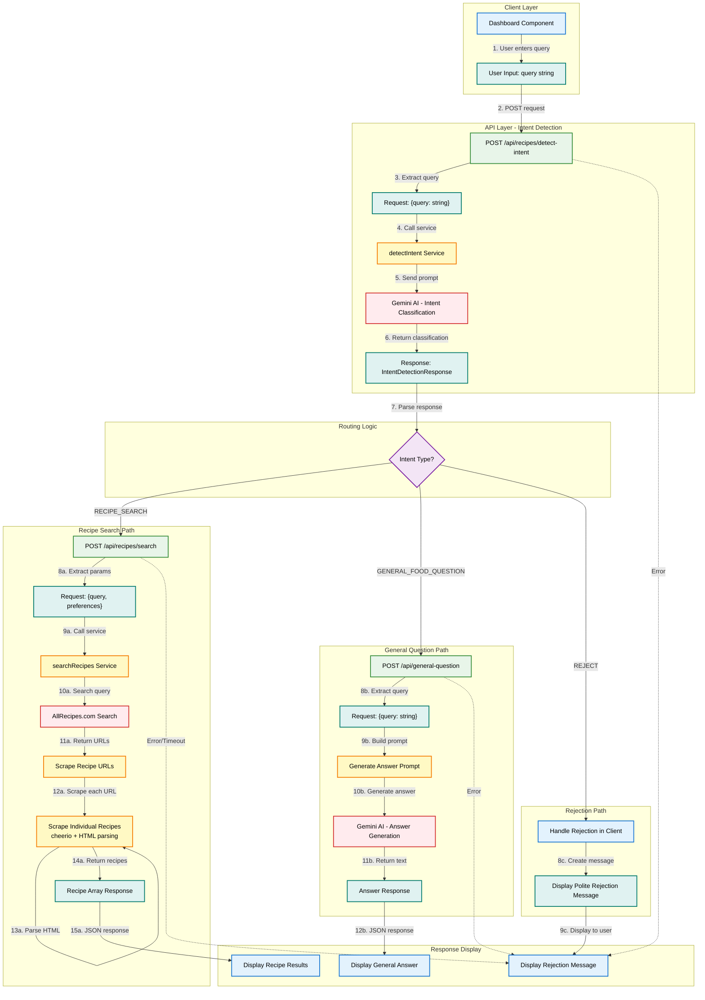

# Recipe Search System Architecture

## Overview

The recipe search system is an intelligent routing architecture that classifies user queries and directs them to appropriate handlers. It uses Gemini AI for intent detection to determine whether users are searching for recipes, asking general cooking questions, or submitting off-topic queries. Once classified, queries are routed to specialized services: recipe searches scrape AllRecipes.com, general questions receive AI-generated answers, and off-topic queries are politely rejected.

## Architecture Diagram



## Legend

### Component Colors
- **Light Blue (Client Layer)**: User-facing components and UI elements
- **Light Green (API Layer)**: Next.js API route handlers
- **Light Yellow (Service Layer)**: Business logic and AI service calls
- **Light Red (External Services)**: Third-party services (Gemini AI, AllRecipes.com)
- **Light Purple (Decision Points)**: Conditional routing logic
- **Light Teal (Data Structures)**: Request/response payloads and data objects

### Connection Types
- **Solid arrows**: Normal data flow
- **Dotted arrows**: Error handling paths

## Component Descriptions

### Client Layer

#### Dashboard Component
- **File**: `src/app/dashboard/page.tsx`
- **Purpose**: Main user interface for recipe search and cooking assistance
- **Key Functions**: 
  - Captures user input via search input field
  - Manages chat message history
  - Displays results (recipes, answers, or rejection messages)
  - Handles recipe selection for sidebar display

#### User Input Data
- **Format**: `{ query: string }`
- **Example**: `"chocolate chip cookies"`, `"how to boil eggs"`, `"what's the weather"`

### API Layer

#### POST /api/recipes/detect-intent
- **File**: `src/app/api/recipes/detect-intent/route.ts`
- **Purpose**: Classifies user intent to route queries appropriately
- **Input**: `{ query: string }`
- **Output**: `IntentDetectionResponse` with intent classification
- **Error Handling**: Returns 400 for invalid input, 500 for service failures

#### POST /api/recipes/search
- **File**: `src/app/api/recipes/search/route.ts`
- **Purpose**: Searches AllRecipes.com and scrapes recipe data
- **Input**: `{ query: string, preferences?: UserPreferences }`
- **Output**: `{ recipes: Recipe[], query: string }`
- **Timeout**: 30 seconds for entire operation
- **Error Handling**: Returns 408 for timeouts, 500 for failures

#### POST /api/general-question
- **File**: `src/app/api/general-question/route.ts`
- **Purpose**: Answers general food and cooking questions using AI
- **Input**: `{ query: string }`
- **Output**: `{ answer: string }`
- **Error Handling**: Returns 400 for invalid input, 500 for AI failures

### Service Layer

#### detectIntent Service
- **File**: `src/services/ai.ts` (function: `detectIntent`)
- **Purpose**: Uses Gemini AI to classify user queries
- **Model**: `gemini-2.0-flash`
- **Output**: JSON with intent, confidence, reason, and optional extracted query
- **Error Handling**: Throws error on parsing or API failures

#### searchRecipes Service
- **File**: `src/services/recipe-scraper.ts` (function: `searchRecipes`)
- **Purpose**: Scrapes AllRecipes.com search results and individual recipes
- **Process**:
  1. Searches AllRecipes.com for query
  2. Extracts recipe URLs from search results (up to 10)
  3. Scrapes each recipe page using cheerio
  4. Extracts title, description, image, times, ingredients, instructions
- **Performance**: 10-second timeout per recipe scrape
- **Data Extraction**: Uses JSON-LD schema and HTML fallbacks

#### Generate Answer Service
- **File**: `src/app/api/general-question/route.ts` (inline)
- **Purpose**: Creates prompt and calls Gemini AI for cooking answers
- **Model**: `gemini-2.0-flash`
- **Prompt Guidelines**: 2-4 sentences, clear, friendly, accurate
- **Safety Focus**: Emphasizes food safety accuracy

### External Services

#### Gemini AI - Intent Classification
- **Model**: `gemini-2.0-flash`
- **Prompt**: Built by `buildIntentDetectionPrompt` function
- **Input**: User message string
- **Output**: JSON with intent classification and confidence
- **Intents**: RECIPE_SEARCH, GENERAL_FOOD_QUESTION, REJECT

#### Gemini AI - Answer Generation
- **Model**: `gemini-2.0-flash`
- **Purpose**: Generates helpful cooking and food knowledge answers
- **Guidelines**: Concise (2-4 sentences), accurate, practical, friendly
- **Context Window**: 1M tokens

#### AllRecipes.com
- **Purpose**: Source of recipe data
- **Search URL**: `https://www.allrecipes.com/search?q={query}&offset={offset}`
- **Scraping Method**: cheerio HTML parsing
- **Data Extracted**: Recipe URLs from search results, full recipe details from individual pages
- **Rate Limiting**: None implemented (consider adding for production)

## Data Flow

### 1. User Initiates Search
User types a query in the Dashboard input field and presses Enter or clicks Send button.

**Data**: `{ query: "chocolate chip cookies" }`

### 2. Intent Detection Request
Dashboard sends POST request to `/api/recipes/detect-intent` with the user's query.

**Request Body**: `{ query: "chocolate chip cookies" }`

### 3. Intent Classification
- API route extracts query and validates input
- Calls `detectIntent()` service function
- Service builds prompt using `buildIntentDetectionPrompt()`
- Gemini AI analyzes query and returns classification

### 4. Intent Response
Gemini AI returns structured response:

```json
{
  "intent": "RECIPE_SEARCH",
  "confidence": "high",
  "reason": "specific recipe request",
  "extractedRecipeQuery": "chocolate chip cookies"
}
```

### 5. Routing Decision
Dashboard evaluates the `intent` field and routes to appropriate handler:

#### Route A: RECIPE_SEARCH → `/api/recipes/search`
1. Extracts `extractedRecipeQuery` or uses original query
2. Sends search request with query and user preferences
3. **searchRecipes Service**:
   - Searches AllRecipes.com for query
   - Finds 10 recipe URLs from paginated results
   - Scrapes each recipe URL using cheerio
   - Parses HTML to extract recipe data (title, image, ingredients, etc.)
   - Returns array of Recipe objects
4. Dashboard displays recipe cards in chat interface

#### Route B: GENERAL_FOOD_QUESTION → `/api/general-question`
1. Sends query to general question endpoint
2. **Answer Generation**:
   - Builds cooking assistant prompt
   - Calls Gemini AI to generate answer
   - Returns concise, helpful response (2-4 sentences)
3. Dashboard displays answer text in chat message

#### Route C: REJECT → Client-side handling
1. Dashboard recognizes REJECT intent
2. Creates polite rejection message:
   > "I'm a cooking assistant, so I can help you with recipes and cooking questions! Please ask me about food, recipes, or cooking techniques."
3. Displays message without making additional API calls

### 6. Response Display
Dashboard adds the appropriate response to the message history:
- **Recipe Results**: Displays recipe cards with images, titles, and quick stats
- **General Answer**: Shows text response in assistant message bubble
- **Rejection**: Shows friendly redirection message

### 7. Error Handling
If any step fails:
- API routes return appropriate error codes (400, 408, 500)
- Dashboard catches errors and displays user-friendly error message
- Chat history maintained, user can retry

## Intent Classification Rules

### RECIPE_SEARCH Intent
**Triggers:**
- User mentions a specific dish name or food item to cook
- User requests recipe suggestions or searches
- Query contains recipe-related keywords with food items

**Examples:**
- "chocolate chip cookies"
- "pasta carbonara"
- "easy vegan brownies"
- "find me a lasagna recipe"
- "chicken curry recipes"

**Processing:**
- Extracts clean recipe query (removes filler words like "find me", "I want")
- Routes to AllRecipes.com search and scraping
- Returns multiple recipe options

### GENERAL_FOOD_QUESTION Intent
**Triggers:**
- User asks "how to" about cooking techniques
- Questions about ingredient properties or food science
- Inquiries about cooking temperatures, times, or methods
- Culinary terminology questions

**Examples:**
- "how do I boil an egg"
- "what is umami"
- "what temperature should chicken be cooked to"
- "what's the difference between baking soda and baking powder"
- "how to dice an onion"

**Processing:**
- Routes to Gemini AI for answer generation
- Returns concise, informative text response
- Emphasizes accuracy for food safety questions

### REJECT Intent
**Triggers:**
- Query completely unrelated to food or cooking
- General conversation attempts
- Questions about weather, news, sports, politics, etc.

**Examples:**
- "what's the weather today"
- "tell me a joke"
- "who won the superbowl"
- "how to fix my computer"

**Processing:**
- Handled client-side without additional API calls
- Displays polite rejection message
- Guides user back to food/cooking topics

## Technical Specifications

### Request/Response Formats

#### Intent Detection
**Request:**
```typescript
{
  query: string
}
```

**Response:**
```typescript
{
  intent: "RECIPE_SEARCH" | "GENERAL_FOOD_QUESTION" | "REJECT",
  confidence: "high" | "medium" | "low",
  reason: string,
  extractedRecipeQuery?: string  // Only present for RECIPE_SEARCH
}
```

#### Recipe Search
**Request:**
```typescript
{
  query: string,
  preferences?: {
    dietaryRestrictions?: string[],
    allergies?: string[],
    avoidedIngredients?: string[],
    location?: { country: string, region?: string }
  }
}
```

**Response:**
```typescript
{
  recipes: Array<{
    id: string,
    title: string,
    description: string,
    imageUrl: string,
    prepTime?: string,
    cookTime?: string,
    servings?: string,
    difficulty?: "Easy" | "Medium" | "Hard",
    sourceUrl: string,
    sourceName: string
  }>,
  query: string
}
```

#### General Question
**Request:**
```typescript
{
  query: string
}
```

**Response:**
```typescript
{
  answer: string
}
```

### Performance Characteristics

- **Intent Detection**: ~1-2 seconds (Gemini AI call)
- **Recipe Search**: ~5-15 seconds (scraping 10 recipes from AllRecipes)
  - Search page scraping: ~1-2 seconds
  - Individual recipe scraping: ~0.5-1 second each (parallel execution)
  - Timeout protection: 30 seconds total, 10 seconds per recipe
- **General Question**: ~1-3 seconds (Gemini AI generation)

### Error Recovery

1. **Intent Detection Failure**
   - Returns 500 error
   - Dashboard displays generic error message
   - User can retry immediately

2. **Recipe Search Timeout**
   - Returns 408 error after 30 seconds
   - Partial results discarded
   - Dashboard suggests trying again

3. **Recipe Scraping Partial Failure**
   - Individual recipe failures logged but skipped
   - Returns successfully scraped recipes
   - Minimum validation: requires title and image

4. **General Question Failure**
   - Returns 500 error
   - Dashboard displays friendly error message
   - User can rephrase or retry

## Model Selection Rationale

### Gemini 2.0 Flash
**Chosen for:**
- Fast response times (1-2 seconds) ideal for real-time interactions
- Cost-effective for high-frequency queries
- 1M token context window for long conversations
- Excellent text generation quality
- Stable production-ready version
- Supports structured JSON output for intent classification

**Use Cases in System:**
1. Intent detection and classification
2. Recipe query extraction and cleaning
3. General cooking question answering
4. Future: Ingredient matching, substitution suggestions

## Future Enhancements

### Intent Detection
- Add confidence thresholds for clarification requests
- Support multi-intent queries (e.g., "find me pasta recipes and explain al dente")
- Track intent history for context-aware classification

### Recipe Search
- Implement caching for popular queries
- Add filtering based on user preferences during search
- Support multiple recipe sources beyond AllRecipes
- Implement rate limiting and retry logic

### General Questions
- Add citation sources for factual claims
- Implement conversation history for follow-up questions
- Include relevant recipe suggestions in answers

### Performance
- Add response caching with TTL
- Implement request deduplication
- Add monitoring and analytics
- Optimize parallel scraping with concurrency limits
